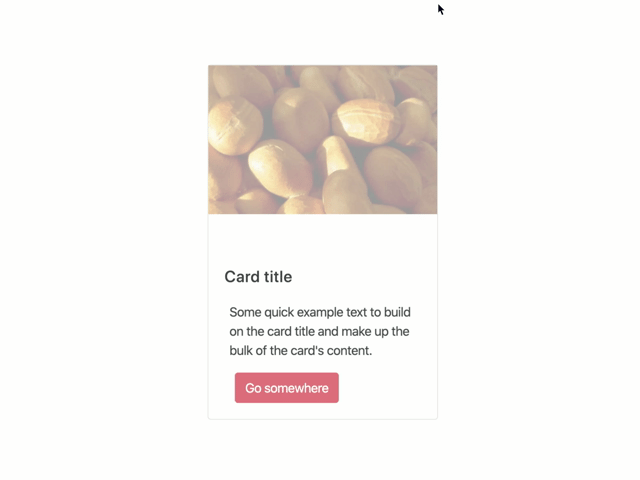

# Complexity

Animation complexity defines the level of effort and design direction needed to craft component animations. 

## None

No motion or animation added.

## Simple

Simple animation complexity is very low. It can be added, updated and removed from components quickly and easily.

-   CSS only motion and animation (using `transition`)
-   No keyframes or complex motion chaining

*A simple transition on a button*

## Enhanced

Enhanced animation complexity has greater engineering complexity than simple animations and can vary depending on design expectations. Due to this increase in complexity, it is recommended that enhanced animations include design direction and engineering planning.

Enhanced animations may include on or more of the following:

-   Simple javascript triggers / class name changes
-   Simple keyframe animations (using CSS `@keyframes` and `animation`, or JS [WAAPI](https://developer.mozilla.org/en-US/docs/Web/API/Web_Animations_API))
-   Multiple simple animations on a single component

*An enhanced card example*

## Complex

Although the level of effort required for a complex animation can vary dramatically, complex animations require clear design direction and engineering planning. These types of animations typically involve JavaScript to trigger motion, multiple motion components and a clear strategy.

Complex animations include the following examples:

-   Parallax scrolling
-   Scroll storytelling
-   Page transitions
-   Custom load animations
-   Custom "scroll-to" animations
-   Background motion
-   SVG animation (simple)
-   Complex UX animations
-   Gesture animations

Some libraries might include:
-   [Anime.js](https://animejs.com/)
-   [GreenSock / GSAP](https://greensock.com/)

*Parallax scrolling: <https://www.firewatchgame.com/>*

*Page storytelling with parallax: <https://store.google.com/product/pixel_3a>*

*Page transitions / scroll to motion: <https://humanebydesign.com/>*

*Page transitions: <https://infinum.com/>*

## Extreme

Extreme motion animation complexity goes above and beyond using CSS and JavaScript to enhance an object and are often fully immersive and necessitate a significant level of effort to accomplish. Due to the high level of complexity, these experiences can be considered self contained projects requiring detailed design guidance and engineering planning. Often, these animations involve additional technologies or tools. Particularly, the use of [WebGL](https://developer.mozilla.org/en-US/docs/Web/API/WebGL_API). This can apply to singular components or entire sites. Some libaries might include:

- [three.js](https://threejs.org/)
- [PixiJS](https://pixijs.com/)
- [react-three-fiber](https://github.com/pmndrs/react-three-fiber)
- [A-Frame](https://aframe.io/)

*Extreme example: <https://activetheory.net/>*

*Extreme example: <https://waaark.com/>*
