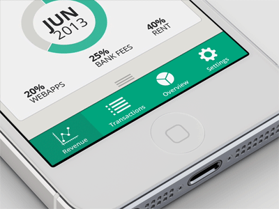

# How & when to use animation

Animation type defines the behavior, intent, interaction, and purpose of the animation.

## UI / Interactive Elements

Interactive UI elements lend logically to explicit motion enhancement. These animation events occur when the component is interacted with (i.e. a button is clicked, focused or hovered). 

In his article [Creating Usability with Motion: The UX in Motion Manifesto](https://medium.com/ux-in-motion/creating-usability-with-motion-the-ux-in-motion-manifesto-a87a4584ddc), Issara Willenskomer, provides a great reference and understanding of the enhancement motion can provide. In short, when discussing animation in terms of UI/Interactive elements, it is more of a tool to achieve enhanced, purposeful, and meaningful interactions rather than simply a mechanism to add delight.

Additionally, it is important to try and understand and utilize mental models from human perceptions on the expectations on how things should behave. In other words, when a user interacts with an element on the page, there is an expectation of what is to come and a visual response to follow.

Imagine these two examples without the transition state and how jarring it would be between frames:

*Context*

*Interface*

Therefore, when enhancing UI/Interactive Elements, consider the enhancement you are providing to the user experience through the lense of expected mental models and meaningful interactions.

Examples of UI / Interactive elements include:

- Buttons & links
- Hamburger navigation fly-out
- Navigation sub-menu reveal
- Accordions
- Cards (i.e. posts grid)
- Modals
- Tooltips
- Loading spinners

## To Delight

Sometimes components or elements can be enhanced with motion to provide 'delight' or to enhance the user experience, but are not typically directly related to the direct interaction of elements.

Examples of motion to delight include:

-   Reveal components on scroll with motion
-   Background animations
-   Page transitions
-   Component loading animations (i.e. staggered reveal in a grid of cards)
-   Motion graphics (logos, svgs)

*To delight -- motion graphics: <https://eab.com/>*

## Storytelling

Animation for storytelling is a finely crafted and designed experience that provides a visual journey for the user. This journey can be in place (i.e. cartoon) or may involve scrolling to reveal and tell the story. 

*Page storytelling with parallax: <https://store.google.com/product/pixel_3a>*

## Immersive Experiences

Immersive experiences are beyond webpage components. These are experiences that feel they take over the page and are completely immersive.

*Immersive example: <https://activetheory.net/>*